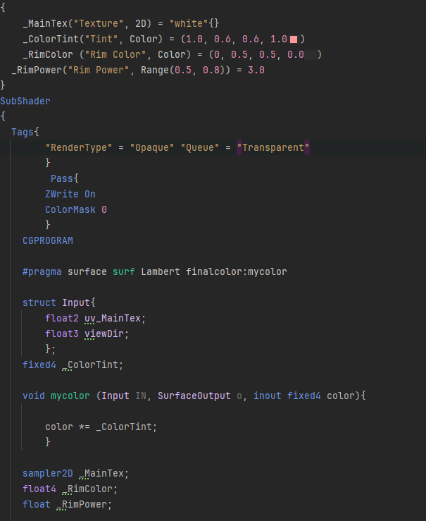

# Shader 1: Color Correction
The first shader I made was the color correction shader, but what was the implementation process for what I did and why I decided to implement it the way I did.
Diagram:

Task: Implement Color Correction Shader for Yoshi Game -> What art style I wanted to make out of it -> realistic -> basic color correction shader was implemented referencing lecture content -> when should an object be color corrected within the game? -> when yoshi needs to rest due to excessive attacking -> adds a sinetime to the color correction specifically for the alpha variable -> makes yoshi flash a color while maintaining yoshi's texture but tells the player yoshi can't shoot 

This was the basic breakdown on what I did with the color correction shader and the diagram in which I tackled issues when and why I made it the way I did. 
Now for a more indepth explanation of how the shader operates and why I made this decision. 
The first decision I made was to determine for what purpose was this color correction shader be used for. After pondering, I decided to use it for when the player fires too rapidly causing them to be placed in a vulnerable state. 
After that decision I went to work with implementing the shader. 

The shader's code is relatively straightforward. The properties for it are just the main texture and the color tint. Due to the realistic nature of this graphical update, ensuring that the player can still see the yoshi texture throughout the state make it more readible and subtle as it isn't a giant blotch of color in the middle of the screen.
Then I went to work for ensuring that the color correction doesn't take over the textures. Within that same implementation, I added the SinTime function. The purpose of this function is to make the yoshi flash the color red, to show it as a debuff and alerts the player. 
Sometimes players won't realize their character has changed color, by adding this sintime, which only affects the alpha, it ensures that the player will be alerted of their current state within the game. 

# Shader 2: Scrolling Shader
The next mandetory shader for me to implement was the scrolling shader. With the direction I was going, I wanted to use it to make the player feel as if the grass and forest are movin around the player. 
Even if the player themselves aren't actually moving and are static. By implementing this scrolling shader, it gives the illusion of movement rather than actually make them move around an open level. 
For the type of game this is, it's more optimal and resource saving to have everything move around th player rather than the player move themselve. As the perspective of the player stays consistent throughout the playthrough. 
It was during the implementation of this shader that I wanted to go a more spooky atmosphere. By adding a wind effect similar to that of the foam from the wave shader, it gives a more ominous atmosphere that I really liked. 
This can be for the level in which Mario is dealing with the Boo type enemines, which are ghosts themselves. 

The second implementation I tried to add was the bump mapping.

The main decision behind this addition was to make it more realistic. By having the trees appear as if they were 3D, despite being a 2D image. It would give the sense of realism. 
I also add the scrolling effect onto the normal and the bump mapping to ensure that the 3D effect is applied to th scrolling effect as well.
It would look incredible awkward if the normals are static andeverything else was moving by the player. 
Which works for my level of this game, which is the running through the forest and shooting Boos!

# Shaedr 3 Rimlighting Shader
I then created a shader for my boo enemy. After realizing the thematic I wanted my shaders to fullfill base on this game. I realized I needed to make a special shader for a more realistic Boo. 
Boo being a ghost would appear transparent or with a rimlighting to give it a supernatural look to it. 
Which is then I decided to go with the rimlighting. The main reason I deicded to go with the rimlighting and not the hologram shader is that rimlighting still appears solid which will give the player the idea that they can still shoot this enemy. 
Hologram being mainly transparent might give the wrong idea to the player and can be harder to see base on this backdrop. Thus the rimlighting was elected instead of the hologram shader. 

The first part of this shader is the implementation of the rimlighting. By adding the queue = transparent it ensure that the rimlighting will still show the texture of the Boo enemy. 

The next part of this shader is the addition of my good old friend SinTime. The reason I used sintime for therimlighting is to give a transformation phase.
This shader will be implementedin between two phases, one where the boo doesn't see the player, which is when the rimlighting ismore calm with a white effect, and the other phase where the Boo is hostile t the player with its red rimlighing. 
This inbetween shader helps bridge together both phases so that the transformation isn't sudden to the player. This also helps the player to know which Boo to prioritize to shoot over the others base on which ones are transforming. 

# Shader 4 Gold Shader
The last shader I implemented for this task was the gold shader. This is for when Mario defeats an enemy and a gold coin spawns in. To maintain that realism I used a specular shader to ensure taht the gold coin feels similar to how a real gold coin would react to light.
The other aspect I tried to implement is an outline shader to at least play homage to the original toon stylized game. This also helps make the gold coin stand out compared to the dark backdrop it is put agaisnt. 

The implementation of this shader was base on combining the specular shader alongside the basic outline shader. 

By ensuring each individual element was repersented within the code, the outline and the specular shader would appear alongside each othe within the final build. The use of specular highlight also makes the gold more reallistic and feel as if it wasa metal. The use of the gold texture sells the point home that it is in fact gold. 

# Conclusion
Overall, I understand that I have taken a giant step away from the original game's art style and atmosphere. However, I do think that these intergration of shaders make for a decent Boo-themed level if the game was to get a graphical overhaul.
By still adding some elements that are more cartoony and less realistic, like the solid outline effect for the gold coin, and the color correction on Yoshi reloading. There is still some reference to the original beloved game.
The shader implementation decisions were all made with the idea of being realistic and to be thematically tied to this enemy that hasn't appeared in the game before, but would be interesting to ideate around. By using SinTime in a couple of my alteration to the original shaders, it gives a bounce type effect on the shader aspect. 
For instance, Yoshi flashing red to show that he is vulnurable to attacks. The use of it on the Boo enemy to change from unsuspecting to hostile towards the player. 
Finally, the scrolling texture just used to keep the player static so that we can optimize what needs to be rendered and what we can do while saving on resources for the game. 
